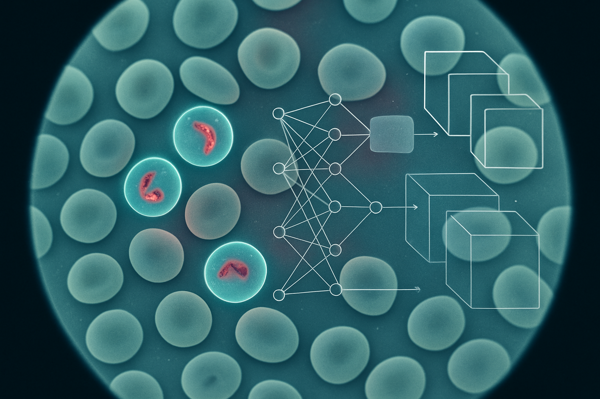

**CNN** **Malaria** **Diagnosis**
**Model**

**Project** **Overview**

This project presents a Convolutional Neural Network (CNN) model
designed for the automated diagnosis of malaria from microscopic blood
smear images. Malaria, a life-threatening disease caused by parasites
transmitted through mosquito bites, requires rapid and accurate
diagnosis for effective treatment and control. Traditional microscopic
diagnosis is labor-intensive, time-consuming, and highly dependent on
the expertise of human technicians. This deep learning solution aims to
provide a fast, accurate, and scalable alternative to assist in malaria
detection, particularly in resource-limited settings.

**Key** **Features**

> • **Automated** **Diagnosis**: Utilizes a CNN to classify blood smear
> images as either 'parasitized' or 'uninfected'.
>
> • **TensorFlow** **and** **Keras**: Built using the powerful
> TensorFlow framework and Keras API for eficient model development and
> training.
>
> • **Malaria** **Dataset** **Integration**: Leverages the
> tfds.load('malaria') dataset, which
>
> contains 27,558 cell images with equal instances of parasitized and
> uninfected cells.
>
> • **Data** **Preprocessing**: Includes steps for data splitting
> (training, validation, testing) and optimization using
> tf.data.AUTOTUNE for improved performance.
>
> • **Model** **Architecture**: Implements a custom CNN architecture
> inspired by LeNet, incorporating Conv2D, BatchNormalization,
> MaxPool2D, Flatten, and Dense
>
> layers.
>
> • **Custom** **Layers** **and** **Callbacks**: Demonstrates the
> implementation of custom Keras layers and various callbacks
> (CSVLogger, EarlyStopping,
>
> LearningRateScheduler, ModelCheckpoint, ReduceLROnPlateau) for
> enhanced
>
> training control and monitoring.
>
> • **Performance** **Metrics**: Evaluates the model using key metrics
> such as accuracy, loss, precision, recall, true positives, false
> positives, true negatives, and false negatives.
>
> • **Visualization**: Provides code for visualizing data samples and
> model performance (e.g., confusion matrix, ROC curve).

**Installation**

To set up and run this project, follow these steps:

> 1\. **Clone** **the** **repository**: bash
>
> git clone https://github.com/your-username/malaria-diagnosis-cnn.git
> cd malaria-diagnosis-cnn
>
> 2\. **Create** **a** **virtual** **environment** **(recommended)**:
> bash
>
> python -m venv venv
>
> source venv/bin/activate \# On Windows, use \`venv\Scripts\activate\`
>
> 3\. **Install** **dependencies**:
>
> The project relies on TensorFlow, Keras, NumPy, Matplotlib, Seaborn,
> and Scikit-learn. You can install them using pip:
>
> bash
>
> pip install tensorflow numpy matplotlib seaborn scikit-learn
> tensorflow-datasets
>
> 4\. **Download** **the** **dataset**:
>
> The notebook automatically downloads the malaria dataset from
> TensorFlow
>
> Datasets. Ensure you have an active internet connection when running
> the notebook for the first time.

**Usage**

> 1\. **Open** **the** **Colab** **Notebook**:
>
> Upload CNN_Malaria_Diagnosis.ipynb to Google Colab or open it in a
> Jupyter
>
> environment.
>
> 2\. **Run** **all** **cells**:
>
> Execute all cells in the notebook sequentially. The notebook will:
>
> ◦ Load and preprocess the malaria dataset. ◦ Define and compile the
> CNN model.
>
> ◦ Train the model using the specified callbacks.
>
> ◦ Evaluate the model's performance on the test set. ◦ Display
> visualizations of the results.
>
> 3\. **Experiment** **with** **parameters**:
>
> Feel free to modify model parameters, training configurations, or
> experiment with different callback settings to observe their impact on
> model performance.

**Project** **Structure**

> • CNN_Malaria_Diagnosis.ipynb: The main Jupyter Notebook containing
> all the
>
> code for data loading, preprocessing, model definition, training,
> evaluation, and visualization.
>
> • logs.csv: (Generated during training) A CSV file containing training
> logs, including
>
> epoch-wise loss and accuracy metrics.
>
> • checkpoints/: (Generated during training) A directory where model
> checkpoints
>
> are saved periodically, allowing for recovery or continuation of
> training.

**Model** **Architecture**

The core of this project is a Convolutional Neural Network (CNN)
designed to classify images of blood cells. The architecture is inspired
by the LeNet-5 model, adapted for image classification tasks. It
consists of the following layers:

> 1\. **Input** **Layer**: Accepts images of size 224x224 pixels with 3
> color channels (RGB).
>
> 2\. **Convolutional** **Layer** **1** **(Conv2D)**: Applies 6 filters
> of size 3x3 with relu activation.
>
> This layer extracts initial features from the input images.
>
> 3\. **Batch** **Normalization** **1** **(BatchNormalization)**:
> Normalizes the activations of the
>
> previous layer, improving training stability and performance.
>
> 4\. **Max** **Pooling** **Layer** **1** **(MaxPool2D)**: Reduces the
> spatial dimensions of the feature
>
> maps, helping to make the model more robust to variations in input and
> reducing computational cost.
>
> 5\. **Dropout** **Layer** **1** **(Dropout)**: A dropout rate of 0.3
> is applied to prevent overfitting
>
> by randomly setting a fraction of input units to 0 at each update
> during training time.
>
> 6\. **Convolutional** **Layer** **2** **(Conv2D)**: Applies 16 filters
> of size 3x3 with relu
>
> activation, extracting higher-level features.
>
> 7\. **Batch** **Normalization** **2** **(BatchNormalization)**:
> Normalizes the activations.
>
> 8\. **Max** **Pooling** **Layer** **2** **(MaxPool2D)**: Further
> reduces spatial dimensions.
>
> 9\. **Flatten** **Layer** **(Flatten)**: Flattens the 2D feature maps
> into a 1D vector, preparing
>
> the data for the fully connected layers.
>
> 10\. **Dense** **Layer** **1** **(Dense)**: A fully connected layer
> with 100 units and relu
>
> activation. This layer learns complex patterns from the flattened
> features. 11. **Batch** **Normalization** **3**
> **(BatchNormalization)**: Normalizes the activations.
>
> 12\. **Dropout** **Layer** **2** **(Dropout)**: Another dropout layer
> with a rate of 0.3 for
>
> regularization.
>
> 13\. **Dense** **Layer** **2** **(Dense)**: A fully connected layer
> with 10 units and relu activation.
>
> 14\. **Batch** **Normalization** **4** **(BatchNormalization)**:
> Normalizes the activations. 15. **Output** **Layer** **(Dense)**: A
> final fully connected layer with 1 unit and sigmoid
>
> activation, outputting a probability score for malaria detection
> (binary classification).

**Model** **Compilation**

The model is compiled with:

\- **Optimizer**: Adam optimizer with a learning rate of 0.01.

\- **Loss** **Function**: BinaryCrossentropy for binary classification.

\- **Metrics**: accuracy, Precision, Recall, TruePositives,
FalsePositives, TrueNegatives, FalseNegatives.

**Custom** **Implementations**

The notebook also demonstrates advanced Keras concepts:

\- **Functional** **API**: An alternative way to define models, allowing
for more flexible and complex architectures.

\- **Model** **Subclassing**: Custom FeatureExtractor and LenetModel
classes are defined,

showcasing object-oriented model building.

\- **Custom** **Layers**: A NeuralearnDense layer is implemented from
scratch, providing a deeper understanding of how Keras layers work
internally.

**Callbacks**

Several Keras callbacks are utilized to enhance the training process:

> • **LossCallback**: A custom callback to print loss at the end of each
> epoch and batch. • **CSVLogger**: Logs epoch results to logs.csv for
> easy analysis.
>
> • **EarlyStopping**: Monitors val_loss and stops training if it
> doesn't improve for a
>
> specified number of epochs (patience=2), preventing overfitting.
>
> • **LearningRateScheduler**: Adjusts the learning rate dynamically
> during training. In
>
> this project, the learning rate is kept constant for the first 10
> epochs and then decays exponentially.
>
> • **ModelCheckpoint**: Saves the model weights or the entire model at
> regular
>
> intervals or when a specific metric improves, ensuring that the best
> model is preserved.
>
> • **ReduceLROnPlateau**: Reduces the learning rate when a metric
> (e.g.,
>
> val_accuracy) has stopped improving, helping the model escape local
> minima.

**Dataset**

This project utilizes the **Malaria** **Dataset** available through
TensorFlow Datasets (tfds.load('malaria')). This dataset is crucial for
training and evaluating the CNN model

for malaria diagnosis. Key characteristics of the dataset include:

> • **Total** **Images**: 27,558 cell images.
>
> • **Classes**: The dataset contains an equal number of instances for
> two classes: ◦ **Parasitized**: Images of blood cells infected with
> malaria parasites.
>
> ◦ **Uninfected**: Images of healthy blood cells.
>
> • **Source**: The images are derived from thin blood smear slide
> images of segmented cells.
>
> • **Citation**: The dataset is associated with the following
> publication: @article{rajaraman2018pre, title={Pre-trained
> convolutional neural networks as
>
> feature extractors toward improved malaria parasite detection in thin
> blood smear images}, author={Rajaraman, Sivaramakrishnan and Antani,
> Sameer K and Poostchi, Mahdieh and Silamut, Kamolrat and Hossain, Md A
> and Maude, Richard J and Jaeger, Stefan and Thoma, George R},
> journal={PeerJ}, volume={6}, pages={e4568}, year={2018},
> publisher={PeerJ Inc.} }

**Data** **Splitting**

The dataset is split into training, validation, and testing sets to
ensure robust model evaluation:

\- **Training** **Set**: 60% of the dataset is used for training the
model.

\- **Validation** **Set**: 20% of the dataset is used for validating the
model during training and tuning hyperparameters.

\- **Test** **Set**: 20% of the dataset is held out for final evaluation
of the model's performance on unseen data.

Data loading and preprocessing are optimized using tf.data.AUTOTUNE and
shufle and batch operations to eficiently feed data to the model during
training.

**Model** **Performance** **and** **Results**

The model was trained for 50 epochs, and its performance was monitored
using various metrics. The training logs show continuous improvement in
accuracy and reduction in loss over the epochs. The validation metrics
indicate the model's generalization capabilities.

Here's a summary of the training progress (example from notebook
output):

||
||
||
||
||
||
||
||
||
||
||
||
||

||
||
||
||
||

*(Note:* *The* *table* *above* *shows* *a* *truncated* *view* *of* *the*
*training* *logs.* *For* *complete* *results,* *refer* *to* *the*
*logs.csv* *file* *generated* *during* *training.)*

